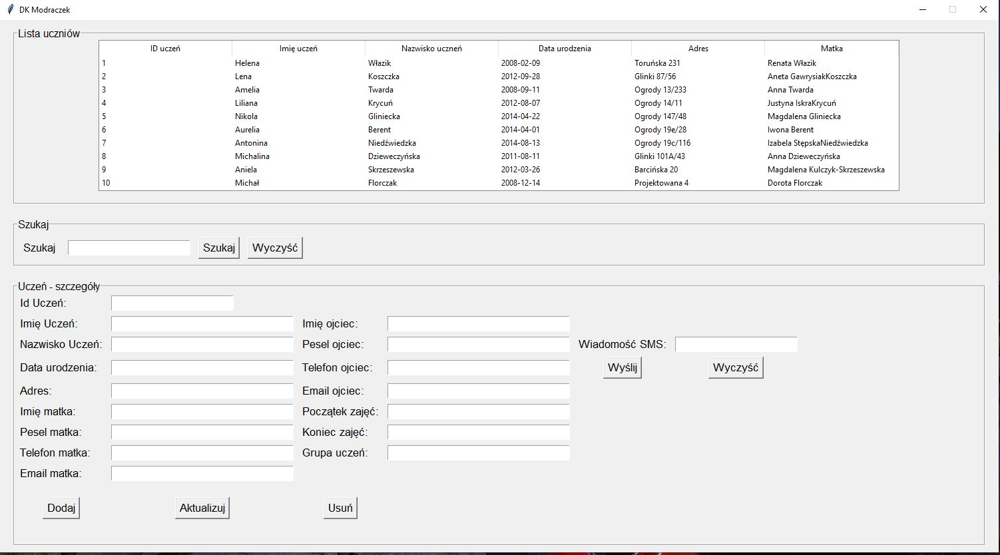

# Dillinger
## _The Last Markdown Editor, Ever_

# DK Modraczek
> DK Modraczek application. it is a database of students who participate in classes organized by DK Modraczek. The application is used to send text messages to selected parents or a group of participants. 

## Table of contents
* [General info](#general-info)
* [Screenshots](#screenshots)
* [Technologies](#technologies)
* [Setup](#setup)
* [Features](#features)
* [Status](#status)
* [Inspiration](#inspiration)
* [Contact](#contact)

## General info
DK Modraczek application. it's my own idea. Until some time, the database of students was kept in Excel. There was often a problem with the correct saving and sharing of the file. Often, employees lacked the ability to quickly inform their parents, for example, about the cancellation of classes. The application organizes the student database and enables quick information in the form of a text message. 

## Screenshots

## Technologies
* Python - version 3.8
* XAMP - version 3.2.4

## Setup
There are two versions for launch:
* EXE on Windows systems
* PY file to be run on any operating system after installing the Python interpreter 

## Code Examples
Show examples of usage:
`    ent_telefonojciec.info = ent_telefonojciec.get()
    ent_telefonmatka.info = ent_telefonmatka.get()
    ent_wiadomoscsms.info = ent_wiadomoscsms.get()
    token = "token example"
    client = SmsApiPlClient(access_token=token)
    send_results = client.sms.send(to=(ent_telefonojciec.info,
                                       ent_telefonmatka.info),
                                   message=ent_wiadomoscsms.info,
                                   from_="DKMODRACZEK")
    for result in send_results:
        print(result.id, result.points, result.error)
    ent_wiadomoscsms.delete(0, END)`

## Features
List of features ready and TODOs for future development
* Group message
* Birthday reminder
* sending single and group e-mails

To-do list:
* Try and Except in searching fields
* Textbox message

## Status
Project is: _in progress_, 

## Inspiration
Completely original project.

## Contact
Created by [@ithelparturgolata](ithelparturgolata@gmail.com) - feel free to contact me!